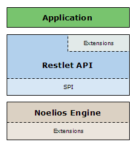

The Restlet framework is composed of two main parts. First, there is the
"[Restlet API](api/)", a neutral API supporting the concepts of REST and
facilitating the handling of calls for both client-side and server-side
applications. This API must be supported by a Restlet implementation
before it can effectively be used. Multiple implementations could be
provided (open source projects or commercial products).

This separation between the API and the implementation is similar to the
one between the Servlet API and Web containers like Jetty or Tomcat, or
between the JDBC API and concrete JDBC drivers. Currently, the "[Restlet
Engine](nre/)" (NRE) is available and acts as the reference
implementation. When you download the Restlet distribution, the API and
the NRE come bundled together, ready to be used. If you need to use a
different implementation just add the implementation JAR file to the
classpath and remove the NRE JAR file named com.noelios.restlet.jar.

The registration is done automatically. See the [JAR
specification](http://java.sun.com/j2se/1.5.0/docs/guide/jar/jar.html#Service%20Provider)
for details. When an implementation is loaded, it automatically calls
back the `org.restlet.util.Engine.setInstance()` method.
